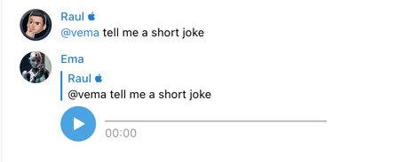

# Ema Telegram Bot 🤖

###### _Photo generated using https://firefly.adobe.com_

Context: 
* Why I created Ema?
    * In this age of AI, I've crafted a bot that's designed to offer my non-technical loved ones a natural and effortless way to access information quickly. By integrating it right into their chat group, I hope that they'll be able to tap into the power of AI without feeling overwhelmed or intimidated.
* Why open source?
    * Because I also like open-source projects, and also I hope to see better Ema versions created by people smarter than me
* Why I created Ema from scratch instead of using an already existent bot project?
    * Because as a nice quote says: "Life is a DIY project"

 

Ema is a Telegram bot that serves as a helpful female assistant named Ema. Ema is designed to answer all your questions or maintain a conversation. The bot is capable of processing text, voice messages, generating photos, and creating image variations. 📱🔊🖼️

### Features 🌟

- Receive text messages from Ema 💬
- Receive voice messages from Ema 🎙️
- Receive generated photos from Ema 📷
- Receive image variations from Ema 🎨
- Transcribe voice messages into text 📝

### Installation 🔧

To use this bot, you need to have the following dependencies installed:

- Python 3.10 🐍
- telebot
- openai
- subprocess
- langdetect
- edge-tts
- openai-whisper (this will use your GPU to transcribe the audio)
- ffmpeg-python
- imgcat
- Pillow (Python Imaging Library) 📸

### Usage 🚀

#### Please use conda to run this project. Check https://docs.anaconda.com/free/anaconda/install/ to see how to install conda on your machine.

1. Clone the repository.
2. Go into the repository directory and run this 3 commands
   * ``conda env create --file ema.yaml``
   * ``conda activate ema_environment``
   * ``pip install -r requirements.txt``
3.  Go into config.py file
    * Replace TELEGRAM_BOT_TOKEN with your TOKEN 🔑. Get a token from [here](https://t.me/botfather)
    * Replace OPEN_API_KEY with your KEY. Get your 🔑 from [here](https://www.google.com/url?sa=t&rct=j&q=&esrc=s&source=web&cd=&cad=rja&uact=8&ved=2ahUKEwiO07Xop8D-AhVjSPEDHbC-BlYQFnoECAwQAQ&url=https%3A%2F%2Fplatform.openai.com%2Faccount%2Fapi-keys&usg=AOvVaw0Uus1Ol-tJ8dIGLAPRllHE)
    * Optionally: Replace any other values. Make it your own.
4. Run the ema.py file to start the bot. 🏃
5. Open the Telegram app and start chatting with your new bot. 🔍

Use the following commands to interact with Ema:

- @ema - Receive a text message from Ema 💬
  - 
- @vema - Receive a vocal message from Ema 🎙️
  - 
- @pema - Receive a generated photo from Ema 📷
  - 
- @iema - Receive an image variation from Ema 🎨
  - 
- @tema - Receive a vocal transcribe text from Ema 📝
  - 

 

You can also reply to messages sent by Ema using the same commands:

- Ask @ema or @vema to give you more information about a message
  - 
- Ask @pema to generate a photo based on a reply
  - 
- Ask @iema to generate a image variation based on a reply
  - 

### License 📄

This project is licensed under the MIT License.
